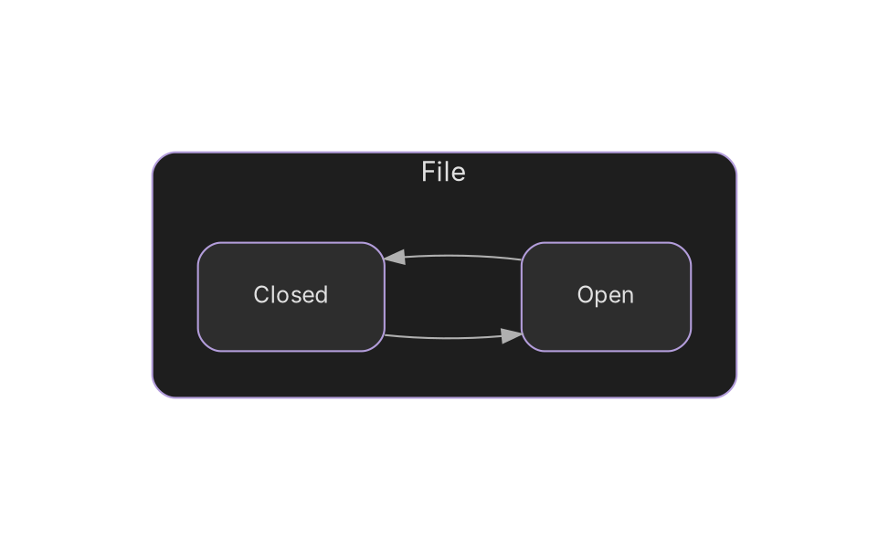
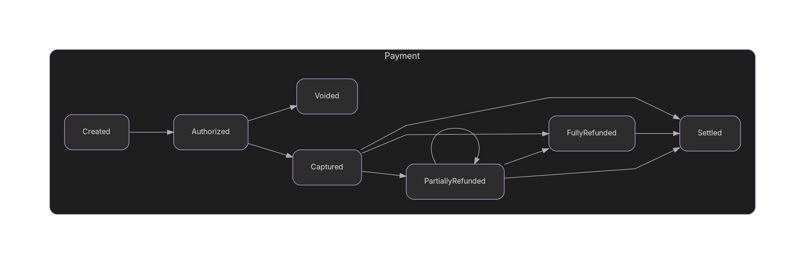
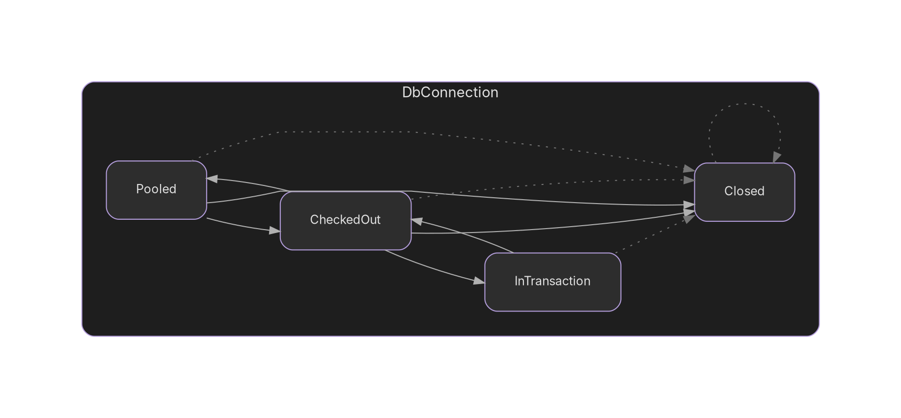
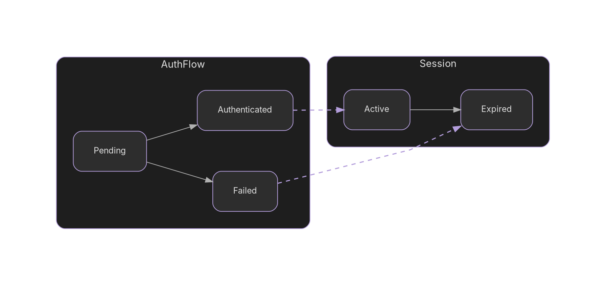

# Visualization

The `typestates dot` command generates GraphViz DOT output for visualizing state machines as diagrams.

## Basic Usage

```bash
# Generate DOT output
typestates dot src/

# Save to file
typestates dot src/ > states.dot

# Generate PNG directly
typestates dot src/ | dot -Tpng -o states.png

# Generate SVG for web
typestates dot src/ | dot -Tsvg -o states.svg
```

## Edge Styles

The CLI uses dark mode styling with different edge styles to distinguish transition types:

| Type | Style | Description |
|------|-------|-------------|
| Normal | Solid light gray | Standard state transitions |
| Wildcard | Dotted gray | Transitions from any state (`* -> State`) |
| Bridge | Dashed light purple | Cross-typestate transitions |

## Example: File State Machine

Given this typestate definition:

```nim
import typestates

type
  File = object
    path: string
  Closed = distinct File
  Open = distinct File

typestate File:
  states Closed, Open
  transitions:
    Closed -> Open
    Open -> Closed
```

Running `typestates dot src/` produces:



Rendered as a diagram:


!!! note "Output Format"
    The CLI generates a unified graph with each typestate as a labeled subgraph.
    This allows multiple typestates and bridges to be visualized together in a single diagram.

## Example: Payment Processing

A more complex example with branching transitions:

```nim
typestate Payment:
  states Created, Authorized, Captured, PartiallyRefunded, FullyRefunded, Settled, Voided
  transitions:
    Created -> Authorized
    Authorized -> Captured | Voided as AuthResult
    Captured -> PartiallyRefunded | FullyRefunded | Settled as CaptureResult
    PartiallyRefunded -> PartiallyRefunded | FullyRefunded | Settled as RefundResult
    FullyRefunded -> Settled
```

DOT output:




## Example: Wildcard Transitions

Wildcard transitions (`* -> State`) are rendered with dotted gray edges:

```nim
typestate DbConnection:
  states Pooled, CheckedOut, InTransaction, Closed
  transitions:
    Pooled -> CheckedOut | Closed as PoolResult
    CheckedOut -> Pooled | InTransaction | Closed as CheckoutResult
    InTransaction -> CheckedOut
    * -> Closed
```

DOT output:




The dotted gray edges indicate transitions that apply from any state (wildcard).

## Installing GraphViz

The DOT output can be rendered with GraphViz. Install it for your platform:

=== "macOS"
    ```bash
    brew install graphviz
    ```

=== "Ubuntu/Debian"
    ```bash
    sudo apt install graphviz
    ```

=== "Windows"
    ```bash
    choco install graphviz
    ```

## Output Formats

GraphViz supports many output formats:

| Format | Command | Use Case |
|--------|---------|----------|
| PNG | `dot -Tpng` | Documentation, README |
| SVG | `dot -Tsvg` | Web, scalable graphics |
| PDF | `dot -Tpdf` | Print, documentation |
| DOT | (raw output) | Further processing |

## Customizing Output

The CLI produces dark mode styled output by default with light purple accents. For easier customization, use `--no-style` to get minimal DOT output:

```bash
# Minimal output without styling - easier to customize
typestates dot --no-style src/ > minimal.dot

# Then add your own styling
typestates dot --no-style src/ | sed 's/node \[shape=box\]/node [shape=box, style=filled, fillcolor=lightblue]/' | dot -Tpng -o custom.png
```

You can also post-process the styled output:

```bash
# Change layout direction (top-to-bottom)
typestates dot src/ | sed 's/rankdir=LR/rankdir=TB/' | dot -Tpng -o vertical.png

# Light mode (swap colors)
typestates dot src/ | sed 's/#2d2d2d/#f5f5f5/g; s/#1e1e1e/#fafafa/g; s/#e0e0e0/#212121/g; s/#b0b0b0/#424242/g' | dot -Tpng -o light.png
```

### --no-style Output

The `--no-style` flag produces minimal DOT:


This is ideal when you want to apply your own colors, fonts, and styling.

## Generating Documentation Images

To include diagrams in your documentation:

```bash
# Create images directory
mkdir -p docs/assets/images

# Generate all typestate diagrams
typestates dot src/ | csplit -f docs/assets/images/state- -b '%02d.dot' - '/^digraph/' '{*}'

# Convert each to SVG
for f in docs/assets/images/state-*.dot; do
  dot -Tsvg "$f" -o "${f%.dot}.svg"
done
```

## Multiple Typestates

If your project has multiple typestates, the `dot` command outputs them all in a single unified graph with separate subgraphs. Bridges between typestates are shown as dashed purple edges.

### Example: Authentication Flow with Session

This example shows two typestates with bridges connecting them:

```nim
# Session typestate
type
  Session = object
    userId: string
  Active = distinct Session
  Expired = distinct Session

typestate Session:
  states Active, Expired
  transitions:
    Active -> Expired

# AuthFlow typestate with bridges to Session
type
  AuthFlow = object
    userId: string
  Pending = distinct AuthFlow
  Authenticated = distinct AuthFlow
  Failed = distinct AuthFlow

typestate AuthFlow:
  states Pending, Authenticated, Failed
  transitions:
    Pending -> Authenticated
    Pending -> Failed
  bridges:
    Authenticated -> Session.Active
    Failed -> Session.Expired
```

Running `typestates dot` produces:



Rendered as a diagram:


This unified format allows you to visualize relationships between different typestates when using bridges.
