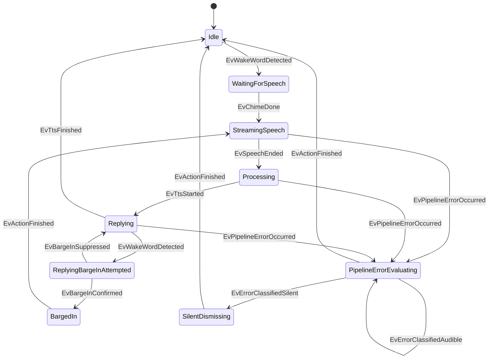

# RFC 001: Reified Event-Typestates & 2D Compile-Time Exhaustiveness Matrix

- **RFC Number**: 001
- **Title**: Reified Event-Typestates Architecture & Compile-Time Exhaustiveness Matrix
- **Author**: Marcus Sterling (`@architect`), Staff Systems Architect
- **Status**: Proposed
- **Target Repositories**:
  - `nim-typestates` (Core macro, parser, codegen, and verification engine)
  - `home-assistant-vibecode-agent` (`esphome/satellite_fsm`)
- **Target Version**: `nim-typestates` v0.13.0
- **Date**: 2026-10-07

---

## 1. Executive Summary & Architectural Motivation

In `nim-typestates` v0.12.0, state machines are declared purely in terms of state distinct types and transitions between states:

```nim
# Prior paradigm (v0.12.0)
typestate SatelliteFSM:
  states Idle, Woken, Listening, Thinking, Replying
  transitions:
    Idle -> Woken
    Woken -> Listening
```

While this guarantees that transitions occur only along valid edges, it lacks a first-class notion of **Reified Events**. As observed in `esphome/satellite_fsm/src/satellite_fsm.nim` (lines 46–138, 202–240), event handling is currently decoupled from the typestate definition and handled via ad-hoc procedures (`onWakeWord`, `onSpeechEnded`, `onSilenceTimeout`).

This structural deficiency produces two critical failure modes in real-world systems:

1. **The Variable-Branching Anti-Pattern (Violation of Invariant Soundness)**:
   In `satellite_fsm.nim` lines 216–239, error handling branches dynamically on string values inside the C API bridge:
   ```nim
   # ANTI-PATTERN: satellite_fsm.nim lines 217-223
   let err = $code
   if err == "stt-no-text-recognized" or err == "duplicate_wake_up_detected":
     if currentState == rsListening:
       ctxDismiss = onSilenceTimeout(ctxListening)
       ctxIdle = onDismiss(ctxDismiss)
   ```
   Furthermore, in lines 171–180:
   ```nim
   proc nim_satellite_chime_done*(ok: bool) {.exportc, cdecl.} =
     if currentState == rsWoken:
       if ok: ... else: ...
   ```
   Runtime control flow is dictated by mutable booleans and strings inside callbacks rather than explicit types. This defeats compile-time verification: unhandled events or invalid event/state pairings silently fall through or produce undefined behavior at runtime.

2. **The Partial-Matrix Hole (Missing Exhaustiveness Guarantees)**:
   A reactive system is an input-driven automaton. For any system with $N$ states and $M$ external events, the complete operational domain is the Cartesian product $S \times E$. Without compile-time matrix exhaustiveness, there is no verification that every possible incoming event is handled or explicitly ignored in every state. An unexpected event arriving during an audio playback state (`Replying`) is either dropped on the floor or causes uncoordinated state divergence.

This RFC introduces **Reified Event-Typestates** to `nim-typestates`:
- First-class `events:` syntax in the `typestate` macro.
- A compile-time 2D ($S \times E$) exhaustiveness matrix.
- Automatic generation of the Event algebraic data type (ADT / tagged union).
- Run-to-Completion (RTC) synchronous transition dispatching.
- The **Zero-Variable-Branching Invariant**, completely eliminating inline value-based branching (`if event == ...`, `if err == ...`) within state transformation paths.

---

## 2. Core Invariants

### Invariant 1: The Zero-Variable-Branching Invariant
> **Invariant**: The pairing of any State $S$ and Reified Event $E$ must resolve to a statically typed target state $S'$ (or an explicit tagged union / branch result), with zero conditional branching (`if`, `case`, `when`) on payload variables inside transition procedures.

If an event payload contains data that dictates multiple possible target states (e.g. an error code or classification), the transition MUST NOT branch internally on that data. Instead:
1. The event transitions into an explicit **Evaluation State** (e.g. `PipelineErrorEvaluating`).
2. The evaluation state transitions to concrete steady or action states via specialized, reified sub-events (e.g. `ErrorClassifiedSilent`, `ErrorClassifiedAudible`).

### Invariant 2: Run-to-Completion (RTC) Synchronous Semantics
> **Invariant**: An event dispatch operation executes synchronously and atomically. Once an event is dequeued, the transition from $S \xrightarrow{E} S'$ runs to completion before any subsequent event can be processed. If $S'$ is an ephemeral evaluation or action state, synchronous micro-steps proceed deterministically until a steady state is reached.

### Invariant 3: Compile-Time 2D Exhaustiveness
> **Invariant**: The Cartesian product $S \times E$ is fully determined at compile time. For every state $s \in S$ and event $e \in E$, the transition matrix must contain an explicit target state, an explicit wildcard mapping, or an explicit ignore directive `(s, e) -> Ignore`. Any missing cell $[s, e]$ produces a compile-time failure.

---

## 3. DSL Syntax & AST Specification

### 3.1 DSL Grammar Extensions

The `typestate` macro grammar (`src/typestates/parser.nim`) is extended with two primary syntactic constructs:
1. The top-level `events:` block.
2. The paired tuple transition syntax `(State, Event) -> TargetState` in `transitions:`.

```nim
typestate SatelliteFSM:
  # 1. State declarations
  states:
    # Steady states
    Idle, WaitingForSpeech, StreamingSpeech, Processing, Replying, ConnectionError
    # Evaluation states
    ReplyingBargeInAttempted, PipelineErrorEvaluating
    # Action states
    BargedIn, ActionSuccess, SilentDismissing

  # 2. Reified Event declarations
  events:
    # Parameterless events (signals)
    SpeechStarted
    SpeechEnded
    SilenceTimeout
    TtsStarted
    TtsFinished
    StopWordReceived
    ConnectionLost
    ConnectionRestored
    BargeInConfirmed
    BargeInSuppressed
    ActionFinished

    # Parameterized events (payloads)
    WakeWordDetected(word: string, angle: int)
    ChimeDone(ok: bool)
    PipelineErrorOccurred(code: string)
    ErrorClassifiedSilent
    ErrorClassifiedAudible(code: string)

  # 3. 2D State x Event Transition Matrix
  transitions:
    # --- Steady State Transitions ---
    (Idle, WakeWordDetected)           -> WaitingForSpeech
    (Idle, ConnectionLost)             -> ConnectionError
    (Idle, *)                          -> Ignore

    (WaitingForSpeech, ChimeDone)      -> StreamingSpeech
    (WaitingForSpeech, SilenceTimeout) -> SilentDismissing
    (WaitingForSpeech, StopWordReceived)-> Idle
    (WaitingForSpeech, PipelineErrorOccurred) -> PipelineErrorEvaluating
    (WaitingForSpeech, ConnectionLost) -> ConnectionError

    (StreamingSpeech, SpeechEnded)     -> Processing
    (StreamingSpeech, StopWordReceived)-> Idle
    (StreamingSpeech, PipelineErrorOccurred) -> PipelineErrorEvaluating
    (StreamingSpeech, ConnectionLost)  -> ConnectionError

    (Processing, TtsStarted)           -> Replying
    (Processing, StopWordReceived)     -> Idle
    (Processing, PipelineErrorOccurred)-> PipelineErrorEvaluating
    (Processing, ConnectionLost)       -> ConnectionError

    (Replying, TtsFinished)            -> Idle
    (Replying, StopWordReceived)       -> Idle
    (Replying, WakeWordDetected)       -> ReplyingBargeInAttempted
    (Replying, PipelineErrorOccurred)  -> PipelineErrorEvaluating
    (Replying, ConnectionLost)         -> ConnectionError

    # --- Evaluation State Transitions (Zero-Variable-Branching) ---
    (ReplyingBargeInAttempted, BargeInConfirmed)  -> BargedIn
    (ReplyingBargeInAttempted, BargeInSuppressed) -> Replying
    (ReplyingBargeInAttempted, StopWordReceived)  -> Idle

    (PipelineErrorEvaluating, ErrorClassifiedSilent)  -> SilentDismissing
    (PipelineErrorEvaluating, ErrorClassifiedAudible) -> PipelineErrorEvaluating # or Action Error
    (PipelineErrorEvaluating, ActionFinished)         -> Idle

    # --- Action State Transitions ---
    (BargedIn, ActionFinished)         -> StreamingSpeech
    (SilentDismissing, ActionFinished) -> Idle

    # --- Global Offline & Recovery ---
    (ConnectionError, ConnectionRestored) -> Idle
    (ConnectionError, *)                  -> Ignore
```

### 3.2 AST Representation

In the Nim compiler AST, the constructs map to standard node trees:

1. **Parameterless Event**:
   ```
   nnkIdent "SpeechStarted"
   ```

2. **Parameterized Event**:
   ```
   nnkCall
     nnkIdent "WakeWordDetected"
     nnkExprColonExpr
       nnkIdent "word"
       nnkIdent "string"
     nnkExprColonExpr
       nnkIdent "angle"
       nnkIdent "int"
   ```

3. **2D Tuple Transition**:
   ```
   nnkInfix
     nnkIdent "->"
     nnkPar
       nnkIdent "Idle"
       nnkIdent "WakeWordDetected"
     nnkIdent "WaitingForSpeech"
   ```

4. **Wildcard Transition**:
   ```
   nnkInfix
     nnkIdent "->"
     nnkPar
       nnkIdent "Idle"
       nnkPrefix
         nnkIdent "*"
     nnkIdent "Ignore"
   ```

### 3.3 Internal Data Structures (`src/typestates/types.nim`)

To support reified events in `TypestateGraph`:

```nim
type
  EventParam* = object
    name*: string
    typeName*: NimNode
    typeRepr*: string
    defaultVal*: NimNode

  EventDecl* = object
    name*: string
    baseName*: string
    params*: seq[EventParam]
    declaredAt*: LineInfo

  EventTransition* = object
    fromState*: string      # State name, or "*" for any state
    eventName*: string      # Event name, or "*" for any event
    toStates*: seq[string]  # Target state(s)
    isIgnore*: bool         # True if `-> Ignore`
    isReject*: bool         # True if `-> Reject`
    branchTypeName*: string
    declaredAt*: LineInfo

  TypestateGraph* = object
    # ... existing fields (lines 177-196) ...
    events*: Table[string, EventDecl]
    eventTransitions*: seq[EventTransition]
    hasReifiedEvents*: bool
```

---

## 4. Compile-Time 2D Exhaustiveness Matrix & Verification

### 4.1 Matrix Representation
Let $S = \{s_1, s_2, \dots, s_n\}$ be the set of declared states.
Let $E = \{e_1, e_2, \dots, e_m\}$ be the set of declared events.
The transition matrix $M$ is an $n \times m$ table where each cell $M[s, e]$ contains a transition descriptor:
$$M[s, e] \in \{ \text{Transition}(s'), \text{Branch}(s'_1 \mid s'_2), \text{Ignore}, \text{Reject} \}$$

### 4.2 Exhaustiveness Algorithm (`src/typestates/verify.nim`)
During macro expansion (or inside `verifyTypestates()`):

1. Construct the matrix grid of size $|S| \times |E|$, initially marked as `Unset`.
2. Process all specific declarations `(s, e) -> T`:
   - If $M[s, e]$ is already set, emit `DuplicateTransitionError`.
   - Set $M[s, e] = T$.
3. Process state wildcards `(s, *) -> T`:
   - For all $e \in E$, if $M[s, e] == \text{Unset}$, set $M[s, e] = T$.
4. Process event wildcards `(*, e) -> T`:
   - For all $s \in S$, if $M[s, e] == \text{Unset}$, set $M[s, e] = T$.
5. Inspect all cells $M[s, e]$:
   - For any cell remaining `Unset`:
     Emit a descriptive compile-time compilation error with line information:
     ```
     typestates/verify.nim: Unhandled event in typestate 'SatelliteFSM':
       State: 'Idle'
       Event: 'SpeechEnded'
       Cell [Idle, SpeechEnded] has no transition rule.

       To resolve:
         1. Declare an explicit transition: (Idle, SpeechEnded) -> TargetState
         2. Declare explicit ignore:        (Idle, SpeechEnded) -> Ignore
         3. Declare an event wildcard:      (Idle, *) -> Ignore
     ```

### 4.3 Visual Diagnostic Formatting
When `-d:typestatesDumpMatrix` is passed, the compiler prints the 2D matrix layout during compilation:

```
+--------------------------+--------------------+--------------------+--------------------+
| State \ Event            | WakeWordDetected   | SpeechEnded        | ConnectionLost     |
+--------------------------+--------------------+--------------------+--------------------+
| Idle                     | WaitingForSpeech   | [Ignore]           | ConnectionError    |
| StreamingSpeech          | [Ignore]           | Processing         | ConnectionError    |
| Replying                 | BargeInAttempted   | [Ignore]           | ConnectionError    |
| ConnectionError          | [Ignore]           | [Ignore]           | [Ignore]           |
+--------------------------+--------------------+--------------------+--------------------+
```

---

## 5. Code Generation (`src/typestates/codegen.nim`)

When `hasReifiedEvents` is true, `generateAll(graph)` emits the following additional artifacts:

### 5.1 Event Tagged Union (ADT)

For typestate `SatelliteFSM`:

```nim
type
  SatelliteFSMEventKind* = enum
    ekWakeWordDetected
    ekChimeDone
    ekSpeechStarted
    ekSpeechEnded
    ekSilenceTimeout
    ekTtsStarted
    ekTtsFinished
    ekStopWordReceived
    ekPipelineErrorOccurred
    ekConnectionLost
    ekConnectionRestored
    ekBargeInConfirmed
    ekBargeInSuppressed
    ekErrorClassifiedSilent
    ekErrorClassifiedAudible
    ekActionFinished

  SatelliteFSMEvent* = object
    case kind*: SatelliteFSMEventKind
    of ekWakeWordDetected:
      wakeWord*: string
      beamAngle*: int
    of ekChimeDone:
      chimeOk*: bool
    of ekPipelineErrorOccurred:
      pipelineErrorCode*: string
    of ekErrorClassifiedAudible:
      audibleErrorCode*: string
    of ekSpeechStarted, ekSpeechEnded, ekSilenceTimeout, ekTtsStarted,
       ekTtsFinished, ekStopWordReceived, ekConnectionLost, ekConnectionRestored,
       ekBargeInConfirmed, ekBargeInSuppressed, ekErrorClassifiedSilent,
       ekActionFinished:
      discard

# Constructor helper procs
proc evWakeWordDetected*(word: string, angle: int): SatelliteFSMEvent {.inline.} =
  SatelliteFSMEvent(kind: ekWakeWordDetected, wakeWord: word, beamAngle: angle)

proc evSpeechEnded*(): SatelliteFSMEvent {.inline.} =
  SatelliteFSMEvent(kind: ekSpeechEnded)
```

### 5.2 Unified State Tagged Union (ADT)

```nim
type
  SatelliteFSMStateKind* = enum
    skIdle
    skWaitingForSpeech
    skStreamingSpeech
    skProcessing
    skReplying
    skConnectionError
    skReplyingBargeInAttempted
    skPipelineErrorEvaluating
    skBargedIn
    skActionSuccess
    skSilentDismissing

  SatelliteFSMState* = object
    case kind*: SatelliteFSMStateKind
    of skIdle: idle*: Idle
    of skWaitingForSpeech: waitingForSpeech*: WaitingForSpeech
    of skStreamingSpeech: streamingSpeech*: StreamingSpeech
    of skProcessing: processing*: Processing
    of skReplying: replying*: Replying
    of skConnectionError: connectionError*: ConnectionError
    of skReplyingBargeInAttempted: replyingBargeIn*: ReplyingBargeInAttempted
    of skPipelineErrorEvaluating: pipelineError*: PipelineErrorEvaluating
    of skBargedIn: bargedIn*: BargedIn
    of skActionSuccess: actionSuccess*: ActionSuccess
    of skSilentDismissing: silentDismissing*: SilentDismissing
```

### 5.3 Synchronous Transition Dispatcher

The dispatcher performs a 2-level exhaustive case dispatch with Run-to-Completion semantics:

```nim
type
  DispatchOutcomeKind* = enum
    dokTransitioned
    dokIgnored
    dokRejected

  DispatchOutcome* = object
    case kind*: DispatchOutcomeKind
    of dokTransitioned:
      nextState*: SatelliteFSMState
    of dokIgnored, dokRejected:
      discard

proc step*(state: SatelliteFSMState, event: SatelliteFSMEvent): DispatchOutcome =
  ## Synchronous transition dispatcher. Exhaustively generated at compile time.
  case state.kind
  of skIdle:
    case event.kind
    of ekWakeWordDetected:
      let next = onWakeWord(state.idle, event.wakeWord, event.beamAngle)
      result = DispatchOutcome(kind: dokTransitioned, nextState: SatelliteFSMState(kind: skWaitingForSpeech, waitingForSpeech: next))
    of ekConnectionLost:
      let next = onDisconnectFromIdle(state.idle)
      result = DispatchOutcome(kind: dokTransitioned, nextState: SatelliteFSMState(kind: skConnectionError, connectionError: next))
    else:
      result = DispatchOutcome(kind: dokIgnored)

  of skReplying:
    case event.kind
    of ekWakeWordDetected:
      let next = onBargeInAttempt(state.replying, event.wakeWord, event.beamAngle)
      result = DispatchOutcome(kind: dokTransitioned, nextState: SatelliteFSMState(kind: skReplyingBargeInAttempted, replyingBargeIn: next))
    of ekTtsFinished:
      let next = onTtsFinished(state.replying)
      result = DispatchOutcome(kind: dokTransitioned, nextState: SatelliteFSMState(kind: skIdle, idle: next))
    of ekPipelineErrorOccurred:
      let next = onPipelineError(state.replying, event.pipelineErrorCode)
      result = DispatchOutcome(kind: dokTransitioned, nextState: SatelliteFSMState(kind: skPipelineErrorEvaluating, pipelineError: next))
    of ekConnectionLost:
      let next = onDisconnectFromReplying(state.replying)
      result = DispatchOutcome(kind: dokTransitioned, nextState: SatelliteFSMState(kind: skConnectionError, connectionError: next))
    else:
      result = DispatchOutcome(kind: dokIgnored)

  # ... Exhaustively covers all sk* and ek* branches ...
```

---

## 6. Downstream Architecture: Satellite Voice Assistant FSM

### 6.1 State Taxonomy
In `home-assistant-vibecode-agent/esphome/satellite_fsm/src/satellite_fsm.nim`, the state machine is partitioned into three rigorous tiers:

1. **Steady States** (Durable, waiting on external IO or human actions):
   - `Idle`: Microphone listening for local microWakeWord model; no active network pipeline.
   - `WaitingForSpeech`: Wake word verified, start chime playing/finished; waiting for VAD speech onset.
   - `StreamingSpeech`: Audio frames streaming over TCP/WebSocket to Home Assistant Wyoming / voice pipeline.
   - `Processing`: User stopped speaking; Home Assistant Whisper STT + intent resolution running.
   - `Replying`: Playing TTS audio stream from Home Assistant over I2S speaker.
   - `ConnectionError`: Disconnected from Home Assistant server; wake word detection halted.

2. **Evaluation States** (Transient, evaluating arbitration conditions without inline variable branching):
   - `ReplyingBargeInAttempted`: Wake word detected while speaker is outputting TTS audio. Evaluates acoustic echo suppression vs. genuine human barge-in before muting audio.
   - `PipelineErrorEvaluating`: Error received from server or pipeline. Evaluates whether the error is benign/inaudible or requires audible user notification.

3. **Action States** (Transient execution states performing side effects before returning to steady states):
   - `BargedIn`: Halts TTS audio output immediately, flushes audio buffers, cancels Home Assistant intent pipeline, and transfers to `StreamingSpeech`.
   - `ActionSuccess`: Triggers local LED confirmation pattern and immediately resets to `Idle`.
   - `SilentDismissing`: Silently closes audio session with zero audio output (e.g. for `stt-no-text-recognized`) and resets to `Idle`.

### 6.2 Zero-Variable-Branching Invariant in Satellite FSM

**Problem in Current Code (`satellite_fsm.nim:216-240`)**:
```nim
proc nim_satellite_error*(code: cstring) {.exportc, cdecl.} =
  let err = $code
  if err == "stt-no-text-recognized" or err == "duplicate_wake_up_detected":
    if currentState == rsListening:
      ctxDismiss = onSilenceTimeout(ctxListening)
      ctxIdle = onDismiss(ctxDismiss)
      currentState = rsIdle
    return
  case currentState
  of rsListening:
    ctxPipelineErr = onPipelineErrorFromListening(ctxListening, err)
    ctxIdle = onResetPipelineError(ctxPipelineErr)
    currentState = rsIdle
```

**Architectural Remediation**:
The C API bridge receives the error code and directly maps it to a reified event:
- If code is `"stt-no-text-recognized"`, the bridge emits `evErrorClassifiedSilent()`.
- If code is `"intent-failed"`, the bridge emits `evErrorClassifiedAudible(code)`.

The transition flow through evaluation and action states is purely structural:


Zero `if` branches inside state transform procs. Every state mutation is represented by an explicit node in the typestate graph.

---

## 7. Compatibility & Migration Plan

1. **Backwards Compatibility**:
   - Typestates without an `events:` block retain existing behavior (unaffected).
   - Existing `transitions:` syntax (`A -> B`) remains valid when `events:` is omitted.
2. **Phase 1 (nim-typestates)**:
   - Implement `events:` and tuple `(S, E) -> S'` parsing in `src/typestates/parser.nim` and `src/typestates/ast_parser.nim`.
   - Implement 2D matrix validation in `src/typestates/verify.nim`.
   - Implement ADT and synchronous dispatcher generation in `src/typestates/codegen.nim`.
3. **Phase 2 (home-assistant-vibecode-agent)**:
   - Refactor `esphome/satellite_fsm/src/satellite_fsm.nim` to use `events:` and tuple transitions.
   - Refactor C API bridge to dispatch reified events into the synchronous dispatcher.
   - Update `tests/test_fsm.nim` to test matrix transitions and barge-in / error evaluation.

---

## 8. Architectural Sign-Off

- **Lead Systems Architect**: Marcus Sterling (`@architect`)
- **Conformance**: Grounded in `nim-typestates` AST architecture and ESPHome voice satellite integration invariants.
- **Git Invariant**: Pure architectural specification; no commits or pushes performed.
